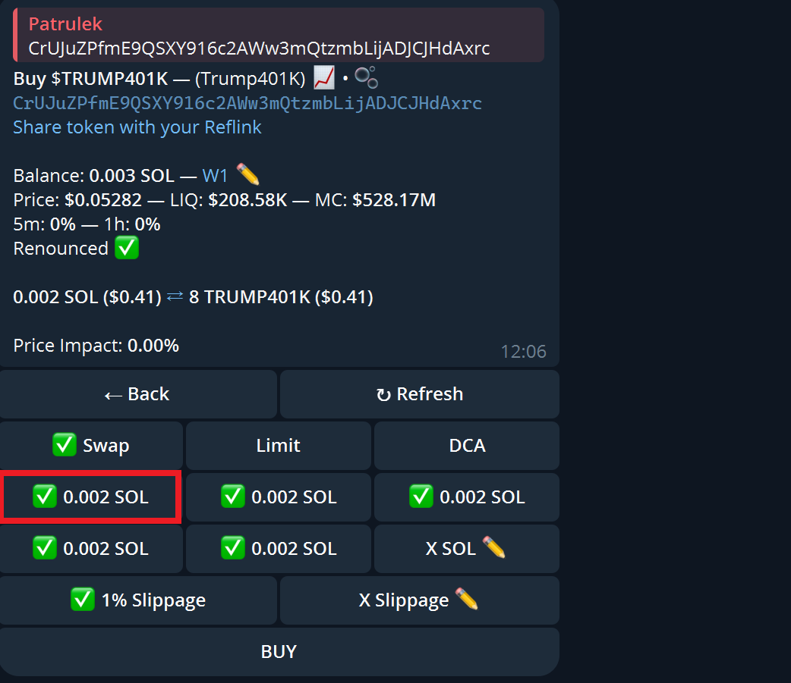

# TrojanBotProxy

Minimal example for working with [TrojanBot Telegram bot](https://x.com/TrojanOnSolana) via code. This example allows you to buy tokens via TrojanBot by pasting token addresses to the console or by configuring HTTP data source that will be polled periodically and response will be fed to TrojanBot channel automatically.

## Build and run

If you want to build it from source, download Go toolchain and write

```console
go build .
```

in the console, then run executable.

If you want to run it from source, download Go toolchain and write

```console
go run .
```

in the console.

Program arguments:

* `-autobuy` - if this flag is true, application will assume that TrojanBot is configured with autobuy option and there will be no need for button click (default: `true`)

## Configuration

`config.toml` is provided to setup application id and application hash that are obtainable from [this link](https://my.telegram.org/apps). In addition to that, phone number and TrojanBot telegram contact name is also required.

You can also use this file to configure HTTP data source.

- `host` + `port` + `method` + `params` - these will be combined into single URI that will be then polled periodically; example:
  - `host` = `"http://example.com"`
  - `port` = `1234`
  - `method` = `"retrievetokens"`
  - `params` = `{ mcap = "10000" }`

  Will be combined into: `http://example.com:1234/retrievetokens?mcap=10000`
- `auth` - authentication method; the only supported auth context is `header`; if that auth context is used, every request sent to data source will be decorated by HTTP header with key equals to `name` and its value equal to `value` object values; example:
  - `auth` = `{ context = "header", name = "X-API-KEY", value = "api-key" }`

  Will add `X-API-KEY = api-key` header to request
- `interval` - data source polling interval; its format is same as Golang's `time.Duration` format (eg. `5s`, `1m`)
- `token_path` - json path to token address value returned by data source; application expect that data source response is array of objects, and `token_path` will try to get token address value for every object at this option value; example:
  - `token_path` = `"taddr"`
  
  With data source response equal to: `[ {"taddr": "tokenpubkey1", "mcap": 12345}, {"taddr": "tokenpubkey2", "mcap": 54321} ]`
  Application will retrieve: `["tokenpubkey1", "tokenpubkey2"]` values and will treat them as token addresses and will pass them to TrojanBot telegram channel.

## Quick start

Program will load `config.toml` file, start HTTP data source polling thread (if configured) and then try to log in to Telegram account. User will be asked for login code and 2FA code (if setup for account). After successful authentication:
- if HTTP data source is configured, application will automatically poll data source for tokens to buy and then pass them to TrojanBot channel
- if no HTTP data source configured, user will be repeatadly asked for a token address to buy by bot; inserting `quit` or `exit` will disconnect session and terminate program

Application will always use the first button on the third row from the bot message, if so many buttons are found, unless `-autobuy` flag is set to true, no matter if HTTP data source is configured or not.



## Sample output

* `-autobuy=false`

```console
Enter code: 45956
Enter token address: CrUJuZPfmE9QSXY916c2AWw3mQtzmbLijADJCJHdAxrc
2024/11/08 11:52:39 INFO buy order placed successfully button="✅ 0.002 SOL"
2024/11/08 11:52:46 INFO reply message message="Buy $TRUMP401K — (Trump401K) 📈 • 🫧\nCrUJuZPfmE9QSXY916c2AWw3mQtzmbL
ijADJCJHdAxrc\nShare token with your Reflink\n\nBalance: 0.003 SOL — W1 ✏️\nPrice: $0.0519 — LIQ: $205.8K — MC: $518.98M\n5m: 0% — 1h: 0%\nRenounced ✅\n\n\n🔴 Insufficient balance for buy amount + gas"
Enter token address: exit
2024/11/08 11:53:03 INFO exiting...
2024/11/08 11:53:03 INFO telegram client finished
```

* `-autobuy=true`

```console
Enter code: 76016
Enter token address: 6aGXXVT9AMY9jJTt7DRVkfv6WqpmTcggFVKrDwBAFpVM
2024/11/08 14:34:20 INFO failed to buy token message="Buy $TOKEN — (TOKEN) 📈 • 🫧\n6aGXXVT9AMY9jJTt7DRVkfv6WqpmTcggF
VKrDwBAFpVM\nShare token with your Reflink\n\nBalance: 0.003 SOL — W1 ✏️\nPrice: ░░░░░░░░ — LIQ: ░░░░░ — MC: ░░░░░\n1h: ░░░░ — 24h: ░░░░\nRenounced ✅\n\n\n🔴 Insufficient balance for buy amount + gas"
```

## Use case

This repo serves as a base for being a proxy to TrojanBot Telegram bot. Assuming you have a good source of tokens to buy, this application just speed up a process to paste their addresses into TrojanBot, comparing to using TrojanBot manually.

Be aware that this repo is only minimal example and should be treated as proof of concept, not finished product. Additionally you still need to manually set up TrojanBot like autosell conditions, setup wallets etc.
